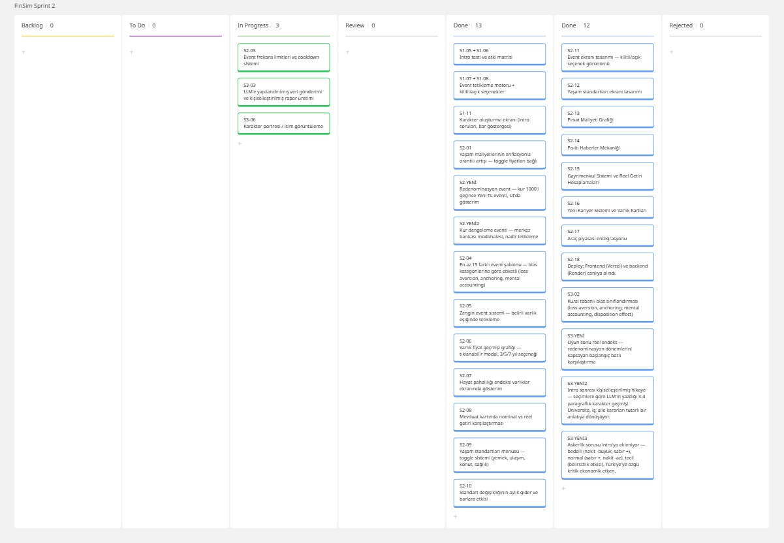

# **Takım İsmi**

Takım 306

# Ürün İle İlgili Bilgiler

## Takım Elemanları

- Samet Coşkun: Product Owner
- Gülsüm Bilgen: Scrum Master
- Eren Osma: Team Member/Developer
- Batuhan Demirbas: Team Member/Developer
- Fırat Özcan: Team Member/Developer

## Ürün İsmi

--FINSIM--

## Ürün Açıklaması

- FINSIM, kullanıcıların finansal kararlarını oyunlaştırılmış bir simülasyon içinde deneyimlemelerini sağlayan tarayıcı tabanlı bir finansal davranış simülasyon oyunudur. Kullanıcı, yıllar içinde yatırım kararları alır, ekonomik olaylarla karşılaşır ve oyun sonunda kendi kararlarının sonuçlarını alternatif senaryolarla karşılaştırır.

## Ürün Özellikleri

- Karakter oluşturma testi
- Para, sabır ve mutluluk barları
- Yıllık finansal karar döngüsü
- Borsa, altın, döviz, gayrimenkul ve mevduat seçenekleri
- Enflasyon etkisini simüle eden ekonomik sistem
- Yaşam standartları menüsü
- Rastgele finansal ve yaşam olayları
- Oyun sonu alternatif senaryo karşılaştırması
- AI destekli kişiselleştirilmiş finansal davranış raporu

## Hedef Kitle

- Finansal okuryazarlığını geliştirmek isteyen kullanıcılar
- Enflasyon, reel getiri ve fırsat maliyetini deneyimleyerek öğrenmek isteyen bireyler
- Yatırım kararlarının uzun vadeli etkisini görmek isteyen kullanıcılar
- Oyunlaştırılmış öğrenme deneyimlerini seven genç yetişkinler
- Finansal kararlarında farkındalık kazanmak isteyen genel kullanıcı kitlesi

## Product Backlog URL

[Miro Backlog Board](https://miro.com/app/board/uXjVH-wS4SE=/)

---

# Sprint 1

- **Backlog düzeni ve Story seçimleri**:
Sprint 1 kapsamında öncelikle ürünün temel mimarisini oluşturacak story'ler belirlenmiştir. Story'ler öncelik sırasına göre Product Backlog'a eklenmiş ve bağımlılık ilişkileri dikkate alınarak sprint planlaması yapılmıştır.

Sprint 1'in temel hedefi; oyunun çalışabilir ilk sürümünü oluşturacak çekirdek sistemi geliştirmektir. Bu doğrultuda GitHub ve dokümantasyon hazırlığı, oyun motoru (Core Engine), karakter oluşturma sistemi, event sistemi ve temel kullanıcı arayüzü (UI) sprint kapsamına alınmıştır.

Story'ler modüllerine göre aşağıdaki başlıklar altında organize edilmiştir:
- GitHub & Dokümantasyon
- Core Engine
- Intro & Karakter Oluşturma
- Event Sistemi
- UI – Sprint 1
  
Her story ekip üyeleri arasında görev dağılımı yapılarak sprint board üzerinde takip edilmektedir.
- **Daily Scrum**:
Takım üyeleri proje fikrinin netleştirilmesi, teknik mimarinin belirlenmesi ve Sprint 1 planlamasının yapılması amacıyla çevrim içi toplantılar gerçekleştirmiştir.
Daily Scrum toplantılarının Slack üzerinden yürütülmesine karar verilmiştir. Sprint süresince yapılan ilerlemeler günlük olarak Slack üzerinden paylaşılacak, teknik konular ekip üyeleri tarafından değerlendirilecek ve ihtiyaç duyulan durumlarda toplantılar ile desteklenecektir.

- **Sprint board update**: Sprint board screenshotları: 

- **Ürün Durumu**: Ekran görüntüleri:
  
  
  

- **Sprint Review**: 
Alınan kararlar:
Sprint 1 sonunda ürünün temel geliştirme planı tamamlanmış, Product Backlog oluşturulmuş ve görev dağılımı netleştirilmiştir.
Sprint kapsamında geliştirilecek modüller belirlenmiş, Miro Board üzerinde sprint yönetimi oluşturulmuş ve geliştirme sürecine başlanmıştır.
Bir sonraki sprintte oyun motorunun (Core Engine), karakter oluşturma sistemi ve temel kullanıcı arayüzünün geliştirilmesine ağırlık verilmesi kararlaştırılmıştır.
Sprint Review Katılımcıları:
- Product Owner
- Scrum Master
- Development Team

- **Sprint Retrospective:**
- Takım içindeki görev dağılımının ve sorumlulukların daha dengeli olacak şekilde yeniden düzenlenmesi.
- Daily Scrum toplantılarının düzenli ve planlı bir şekilde gerçekleştirilmesi.
-  GitHub üzerinde daha sık commit yapılması.
- Sprint Board'un geliştirme süreci boyunca güncel tutulması.
- Story'lerin gerektiğinde daha küçük görevlere (task) bölünerek geliştirme sürecinin kolaylaştırılması.
---

# Sprint 2

- **Backlog düzeni ve Story seçimleri**:
Sprint 2 kapsamında oyunun temel özelliklerinin üzerine daha karmaşık finansal mekanikler ve iyileştirmeler eklenmesi planlanmıştır.

Yapılan geliştirmeler şu şekilde özetlenebilir:
- Sektörel borsa eventleri ve fısıltı haberler (Whisper News) mekaniği eklendi.
- Gayrimenkul sistemi ve araç piyasası entegrasyonu tamamlandı.
- Reel getiri hesaplamaları ve fırsat maliyeti grafiği oyun raporuna dâhil edildi.
- Oyuna yeni iş sistemi, öğretici mod (Tutorial) ve açılış ekranında eğitici açıklamalar eklendi.
- Yaşam standartları maliyetleri ve etkileri dengelendi.
- AI ajanları (AI agents) entegrasyonu tamamlandı.
- Varlıklar sayfasına portföy değeri, nakit ve enflasyon kartları eklendi.
- Geliştirici leaderboard'u (Dev leaderboard) ve UI iyileştirmeleri yapıldı.

- **Daily Scrum**:
Daily Scrum toplantıları Slack üzerinden yapılmaya devam etmiştir. Ekip üyeleri kodlama sürecinde karşılaştıkları problemleri hızlıca birbirlerine danışarak (örneğin; build hataları, CORS izinleri) çözüm üretmişlerdir. 

- **Sprint board update**: Sprint board screenshotları: 

Sprint 2 Sprint Board: Sprint 2 kapsamında planlanan Story'lerin geliştirme süreci Miro Sprint Board üzerinden takip edilmiştir. Görevler geliştirme durumlarına göre Backlog, To Do, In Progress, Review, Done ve Rejected sütunlarında yönetilmiş, tamamlanan çalışmalar sprint sonunda Done sütununa taşınmıştır.

- **Ürün Durumu**: Ekran görüntüleri:
  
  
  

- **Sprint Review**: 
Alınan kararlar:
Sprint 2 sonucunda temel ve gelişmiş mekaniklerin (Borsa, gayrimenkul, iş, yaşam standartları, AI) birçoğu oyuna entegre edildi ve UI iyileştirilmeleri ile oyuncuya daha iyi bir deneyim sunulması sağlandı.
Oyun sonu geri bildirimlerin (AI agents, fırsat maliyeti) zenginleştirildiği görüldü.
Bir sonraki sprintte sistemlerin detaylı test edilmesi, varsa açıkların kapatılması ve oyunun final cila aşamalarının yapılması kararlaştırıldı.

Sprint Review Katılımcıları:
- Product Owner
- Scrum Master
- Development Team

- **Sprint Retrospective:**
- Oyun içi ekonominin (yaşam standartları, enflasyon etkileri vb.) dengelenmesine önem verilmesinin faydalı olduğu anlaşıldı.
- Commit mesajlarının ve geliştirmelerin özellik (feature) bazlı yapılması iş takibini kolaylaştırdı, bu yaklaşıma devam edilecek.
- Eksik görülen noktalarda hızlı aksiyon alınıp öğretici (tutorial) eklentileri gibi özelliklerin sunulması ürünün kullanılabilirliğini artırdı.

  

---

# Sprint 3

---
