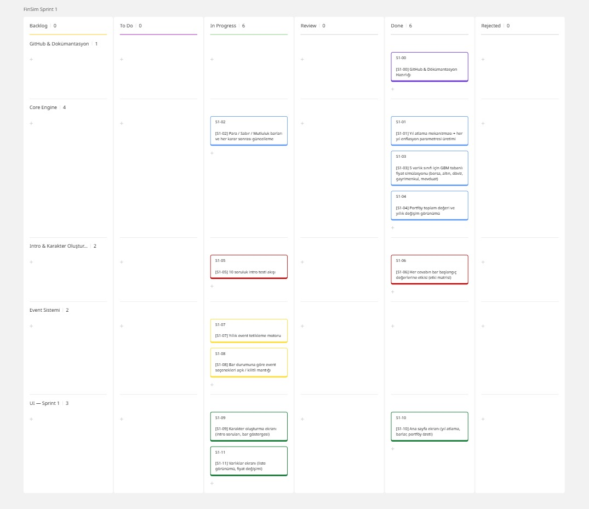
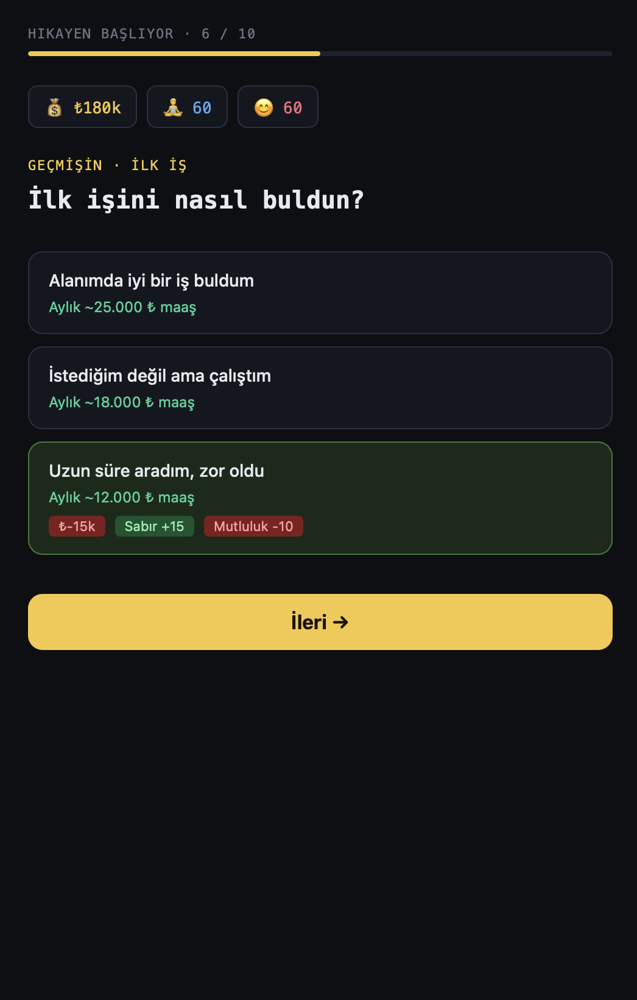
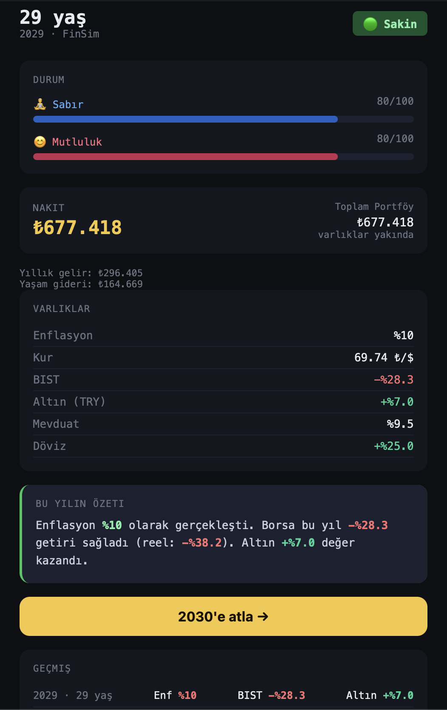
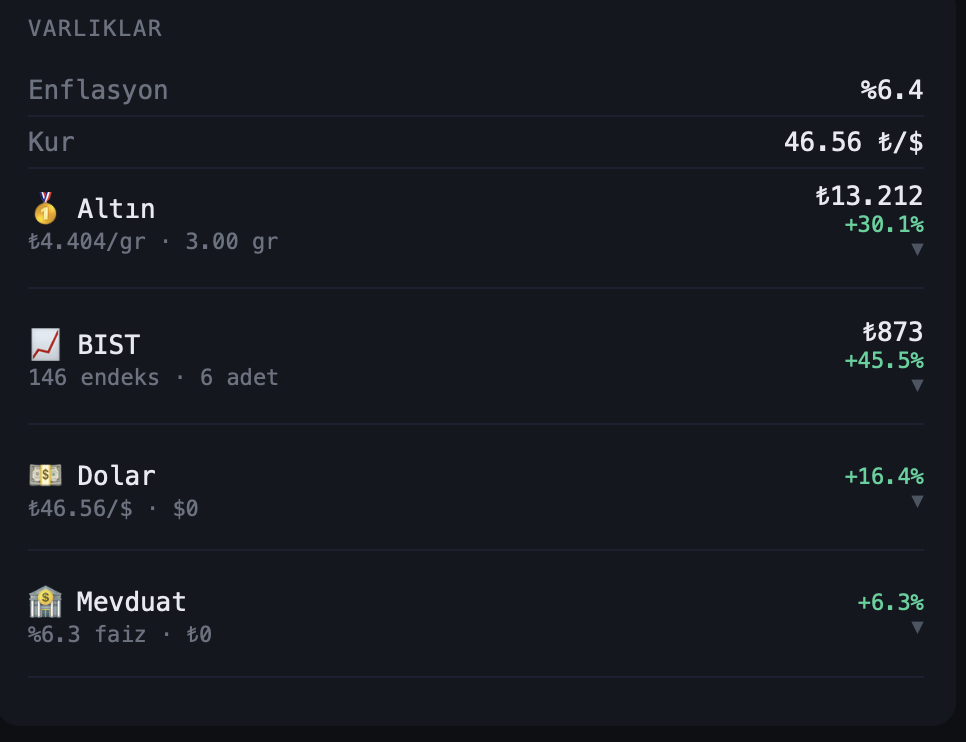

# **Takım İsmi**

Takım 306

# Ürün İle İlgili Bilgiler

## Takım Elemanları

- Samet Coşkun: Product Owner
- Gülsüm Bilgen: Scrum Master
- Eren Osma: Team Member/Developer
- Batuhan Demirbas: Team Member/Developer
- Fırat Özcan: Team Member/Developer

## Ürün İsmi

--FINSIM--

## Ürün Açıklaması

- FINSIM, kullanıcıların finansal kararlarını oyunlaştırılmış bir simülasyon içinde deneyimlemelerini sağlayan tarayıcı tabanlı bir finansal davranış simülasyon oyunudur. Kullanıcı, yıllar içinde yatırım kararları alır, ekonomik olaylarla karşılaşır ve oyun sonunda kendi kararlarının sonuçlarını alternatif senaryolarla karşılaştırır.

## Ürün Özellikleri

- Karakter oluşturma testi
- Para, sabır ve mutluluk barları
- Yıllık finansal karar döngüsü
- Borsa, altın, döviz, gayrimenkul ve mevduat seçenekleri
- Enflasyon etkisini simüle eden ekonomik sistem
- Yaşam standartları menüsü
- Rastgele finansal ve yaşam olayları
- Oyun sonu alternatif senaryo karşılaştırması
- AI destekli kişiselleştirilmiş finansal davranış raporu

## Hedef Kitle

- Finansal okuryazarlığını geliştirmek isteyen kullanıcılar
- Enflasyon, reel getiri ve fırsat maliyetini deneyimleyerek öğrenmek isteyen bireyler
- Yatırım kararlarının uzun vadeli etkisini görmek isteyen kullanıcılar
- Oyunlaştırılmış öğrenme deneyimlerini seven genç yetişkinler
- Finansal kararlarında farkındalık kazanmak isteyen genel kullanıcı kitlesi

## Product Backlog URL

[Miro Backlog Board](https://miro.com/app/board/uXjVH-wS4SE=/)

---

# Sprint 1

- **Backlog düzeni ve Story seçimleri**:
Sprint 1 kapsamında öncelikle ürünün temel mimarisini oluşturacak story'ler belirlenmiştir. Story'ler öncelik sırasına göre Product Backlog'a eklenmiş ve bağımlılık ilişkileri dikkate alınarak sprint planlaması yapılmıştır.

Sprint 1'in temel hedefi; oyunun çalışabilir ilk sürümünü oluşturacak çekirdek sistemi geliştirmektir. Bu doğrultuda GitHub ve dokümantasyon hazırlığı, oyun motoru (Core Engine), karakter oluşturma sistemi, event sistemi ve temel kullanıcı arayüzü (UI) sprint kapsamına alınmıştır.

Story'ler modüllerine göre aşağıdaki başlıklar altında organize edilmiştir:
- GitHub & Dokümantasyon
- Core Engine
- Intro & Karakter Oluşturma
- Event Sistemi
- UI – Sprint 1
  
Her story ekip üyeleri arasında görev dağılımı yapılarak sprint board üzerinde takip edilmektedir.
- **Daily Scrum**:
Takım üyeleri proje fikrinin netleştirilmesi, teknik mimarinin belirlenmesi ve Sprint 1 planlamasının yapılması amacıyla çevrim içi toplantılar gerçekleştirmiştir.
Daily Scrum toplantılarının Slack üzerinden yürütülmesine karar verilmiştir. Sprint süresince yapılan ilerlemeler günlük olarak Slack üzerinden paylaşılacak, teknik konular ekip üyeleri tarafından değerlendirilecek ve ihtiyaç duyulan durumlarda toplantılar ile desteklenecektir.

- **Sprint board update**: Sprint board screenshotları: 

- **Ürün Durumu**: Ekran görüntüleri:
  
  
  

- **Sprint Review**: 
Alınan kararlar:
Sprint 1 sonunda ürünün temel geliştirme planı tamamlanmış, Product Backlog oluşturulmuş ve görev dağılımı netleştirilmiştir.
Sprint kapsamında geliştirilecek modüller belirlenmiş, Miro Board üzerinde sprint yönetimi oluşturulmuş ve geliştirme sürecine başlanmıştır.
Bir sonraki sprintte oyun motorunun (Core Engine), karakter oluşturma sistemi ve temel kullanıcı arayüzünün geliştirilmesine ağırlık verilmesi kararlaştırılmıştır.
Sprint Review Katılımcıları:
- Product Owner
- Scrum Master
- Development Team

- **Sprint Retrospective:**
- Takım içindeki görev dağılımının ve sorumlulukların daha dengeli olacak şekilde yeniden düzenlenmesi.
- Daily Scrum toplantılarının düzenli ve planlı bir şekilde gerçekleştirilmesi.
-  GitHub üzerinde daha sık commit yapılması.
- Sprint Board'un geliştirme süreci boyunca güncel tutulması.
- Story'lerin gerektiğinde daha küçük görevlere (task) bölünerek geliştirme sürecinin kolaylaştırılması.
---

# Sprint 2

- **Backlog düzeni ve Story seçimleri**:
Sprint 2 kapsamında öncelikle Sprint 1'den devreden öncelikli Story'lerin tamamlanması ve Event Sistemi'nin kullanıcıyla etkileşimli hale getirilmesi hedeflenmiştir. Story'ler Product Backlog'daki öncelik sırasına göre Sprint Board'a aktarılmış ve bağımlılık ilişkileri dikkate alınarak sprint planlaması yapılmıştır.

Sprint 2'nin temel hedefi; Intro Testi ve Event Tetikleme Motoru'nun tamamlanması, Event Sistemi'nin geliştirilmesi, Backend ve Frontend entegrasyonunun sağlanması, kullanıcı arayüzünün iyileştirilmesi ve finansal verilerin kullanıcıya grafiklerle sunulmasını sağlayacak temel mekaniklerin geliştirilmesidir. Sprint kapsamında planlanan geliştirmeler tamamlanarak ürünün oynanabilirliği ve kullanıcı etkileşimi önemli ölçüde artırılmıştır.

Story'ler modüllerine göre aşağıdaki başlıklar altında organize edilmiştir:

- Sprint 1'den Devreden Story'ler
- Event Sistemi
- Backend Entegrasyonu
- Frontend Event Arayüzü
- Kullanıcı Deneyimi (UI)
- Finansal Görselleştirme

Her Story ekip üyeleri arasında görev dağılımı yapılarak Sprint Board üzerinde takip edilmiş ve tamamlanan görevler ilgili sütunlara taşınmıştır.

- **Daily Scrum**:
Takım üyeleri Sprint 2 süresince Event Sistemi, Backend-Frontend entegrasyonu ve kullanıcı arayüzü geliştirmelerinin koordineli şekilde ilerleyebilmesi amacıyla düzenli çevrim içi toplantılar gerçekleştirmiştir.

Daily Scrum toplantıları Sprint 1'de alınan karar doğrultusunda Slack üzerinden yürütülmeye devam edilmiştir. Sprint süresince yapılan geliştirmeler günlük olarak Slack üzerinden paylaşılmış, teknik konular ekip üyeleri tarafından değerlendirilmiş ve ihtiyaç duyulan durumlarda çevrim içi toplantılar ile desteklenmiştir.

- **Sprint board update**: Sprint board screenshotları: 

- **Ürün Durumu**: Ekran görüntüleri:
  
  
  

- **Sprint Review**: 
Alınan kararlar:
Sprint 2 sonunda Sprint 1'den devreden öncelikli Story'ler tamamlanmış, Event Sistemi'nin temel bileşenleri geliştirilmiş ve Backend ile Frontend entegrasyonu başarıyla gerçekleştirilmiştir.

Sprint kapsamında Event JSON veri yapısı oluşturulmuş, Event Havuzu genişletilmiş, Event ekranı geliştirilmiş, Event Cooldown Sistemi uygulanmış ve kullanıcı deneyimini iyileştiren Bar Animasyonları ile Varlık Fiyat Grafiği oyuna entegre edilmiştir.

Sprint sonunda planlanan geliştirmeler tamamlanarak ürünün temel oyun mekanikleri güçlendirilmiş ve kullanıcı etkileşimini artıran yeni özellikler başarıyla sisteme kazandırılmıştır. Bir sonraki sprintte kariyer sistemi, gayrimenkul mekanikleri, borsa ve davranışsal analiz özelliklerinin geliştirilmesine ağırlık verilmesi kararlaştırılmıştır.
Sprint Review Katılımcıları:
- Samet Coşkun: Product Owner
- Gülsüm Bilgen: Scrum Master
- Eren Osma: Team Member/Developer
- Batuhan Demirbas: Team Member/Developer
- Fırat Özcan: Team Member/Developer

- **Sprint Retrospective:**
- Event sistemi geliştirmelerinde görev bağımlılıklarının daha erken planlanması.
- Daily Scrum toplantılarının düzenli ve planlı şekilde Slack üzerinden sürdürülmesi.
- GitHub üzerinde düzenli commit ve kod inceleme (Code Review) süreçlerinin devam ettirilmesi.
- Event sistemi ve finansal simülasyon mekaniklerinin Sprint 3'te daha da geliştirilmesi.
- Oyun deneyimini artıracak yeni özellikler ve iyileştirmelerin Sprint 3 kapsamında planlanması.

  

---

# Sprint 3

---
