# **Takım İsmi**

Takım 306

# Ürün İle İlgili Bilgiler

## Takım Elemanları

- Samet Coşkun: Product Owner
- Gülsüm Bilgen: Scrum Master
- Eren Osma: Team Member/Developer
- Batuhan Demirbas: Team Member/Developer
- Fırat Özcan: Team Member/Developer

## Ürün İsmi

--FINSIM--

📍 **Ürünün güncel sürümünü incelemek için:** [FINSIM Canlı Ortam](https://frontend-phi-ivory-81.vercel.app)

## Ürün Açıklaması

- FINSIM, kullanıcıların finansal kararlarını oyunlaştırılmış bir simülasyon içinde deneyimlemelerini sağlayan tarayıcı tabanlı bir finansal davranış simülasyon oyunudur. Kullanıcı, yıllar içinde yatırım kararları alır, ekonomik olaylarla karşılaşır ve oyun sonunda kendi kararlarının sonuçlarını alternatif senaryolarla karşılaştırır.

## Ürün Özellikleri

- Karakter oluşturma testi
- Para, sabır ve mutluluk barları
- Yıllık finansal karar döngüsü
- Borsa, altın, döviz, gayrimenkul ve mevduat seçenekleri
- Enflasyon etkisini simüle eden ekonomik sistem
- Yaşam standartları menüsü
- Rastgele finansal ve yaşam olayları
- Oyun sonu alternatif senaryo karşılaştırması
- AI destekli kişiselleştirilmiş finansal davranış raporu

## Hedef Kitle

- Finansal okuryazarlığını geliştirmek isteyen kullanıcılar
- Enflasyon, reel getiri ve fırsat maliyetini deneyimleyerek öğrenmek isteyen bireyler
- Yatırım kararlarının uzun vadeli etkisini görmek isteyen kullanıcılar
- Oyunlaştırılmış öğrenme deneyimlerini seven genç yetişkinler
- Finansal kararlarında farkındalık kazanmak isteyen genel kullanıcı kitlesi

## Product Backlog URL

[Miro Backlog Board](https://miro.com/app/board/uXjVH-wS4SE=/)

---

# Sprint 1

- **Backlog düzeni ve Story seçimleri**:
Sprint 1 kapsamında öncelikle ürünün temel mimarisini oluşturacak story'ler belirlenmiştir. Story'ler öncelik sırasına göre Product Backlog'a eklenmiş ve bağımlılık ilişkileri dikkate alınarak sprint planlaması yapılmıştır.

Sprint 1'in temel hedefi; oyunun çalışabilir ilk sürümünü oluşturacak çekirdek sistemi geliştirmektir. Bu doğrultuda GitHub ve dokümantasyon hazırlığı, oyun motoru (Core Engine), karakter oluşturma sistemi, event sistemi ve temel kullanıcı arayüzü (UI) sprint kapsamına alınmıştır.

Story'ler modüllerine göre aşağıdaki başlıklar altında organize edilmiştir:
- GitHub & Dokümantasyon
- Core Engine
- Intro & Karakter Oluşturma
- Event Sistemi
- UI – Sprint 1
  
Her story ekip üyeleri arasında görev dağılımı yapılarak sprint board üzerinde takip edilmektedir.
- **Daily Scrum**:
Takım üyeleri proje fikrinin netleştirilmesi, teknik mimarinin belirlenmesi ve Sprint 1 planlamasının yapılması amacıyla çevrim içi toplantılar gerçekleştirmiştir.
Daily Scrum toplantılarının Slack üzerinden yürütülmesine karar verilmiştir. Sprint süresince yapılan ilerlemeler günlük olarak Slack üzerinden paylaşılacak, teknik konular ekip üyeleri tarafından değerlendirilecek ve ihtiyaç duyulan durumlarda toplantılar ile desteklenecektir.

- **Sprint board update**: Sprint board screenshotları: 
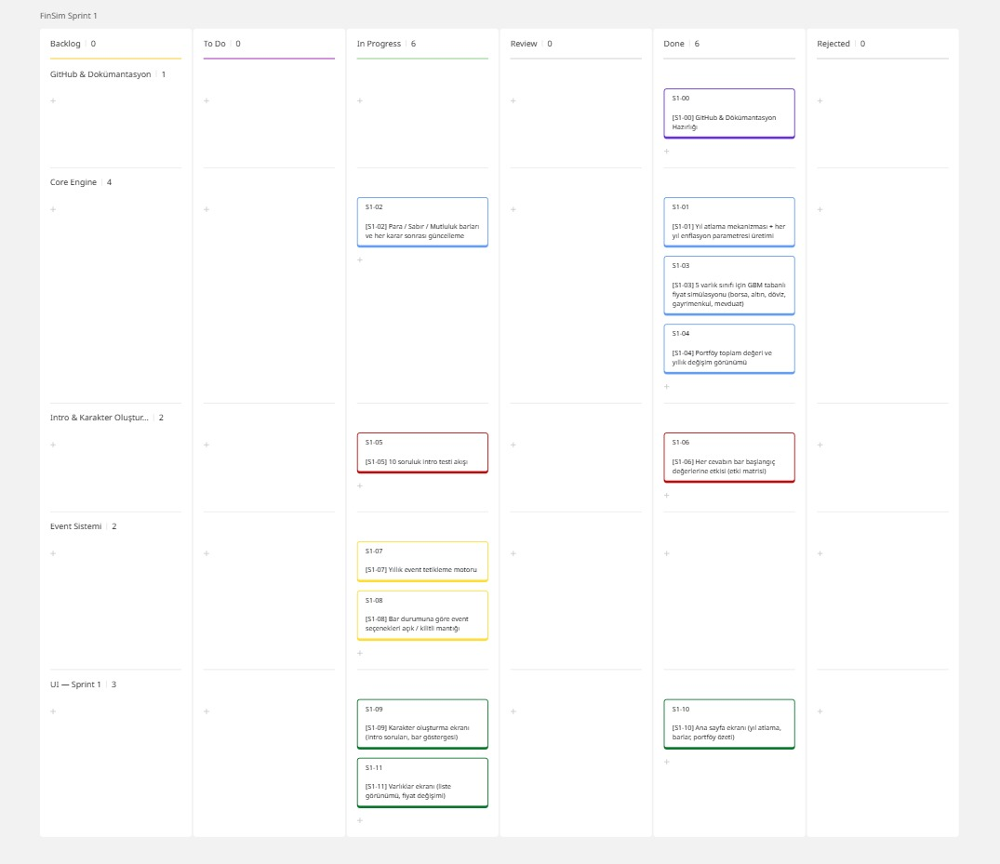

- **Ürün Durumu**: Ekran görüntüleri:
  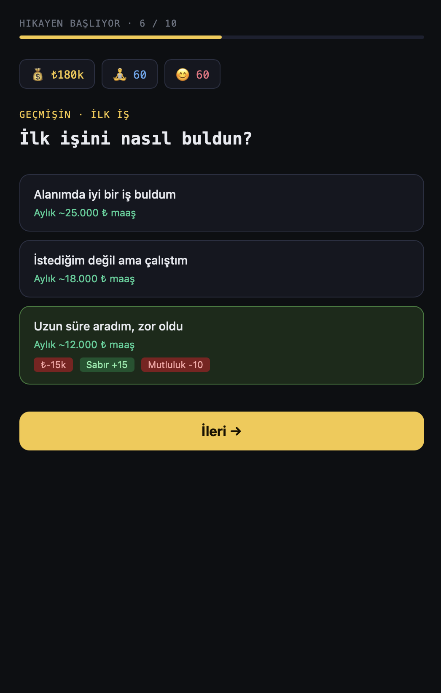
  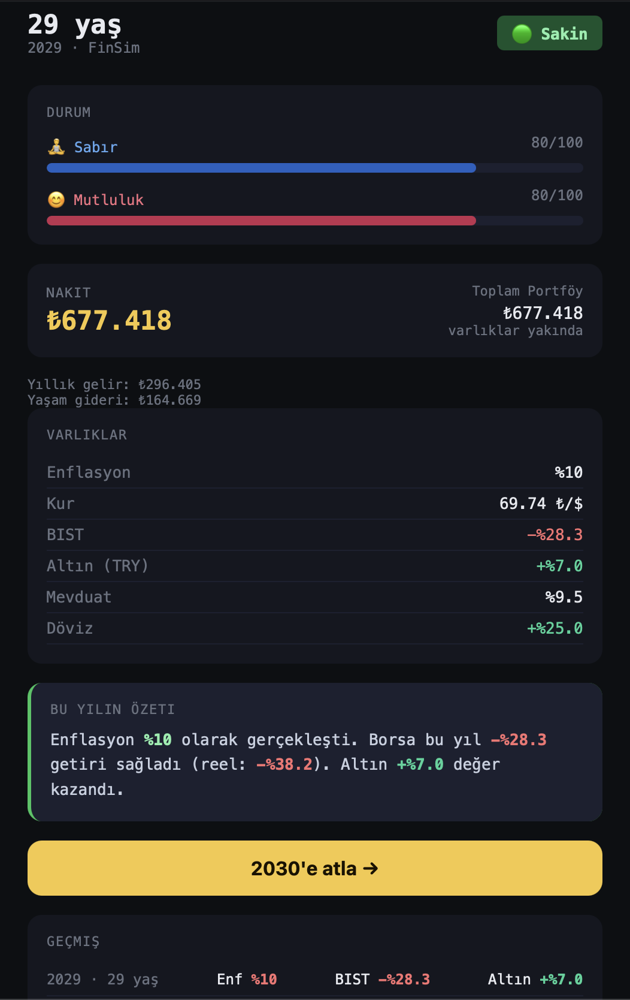
  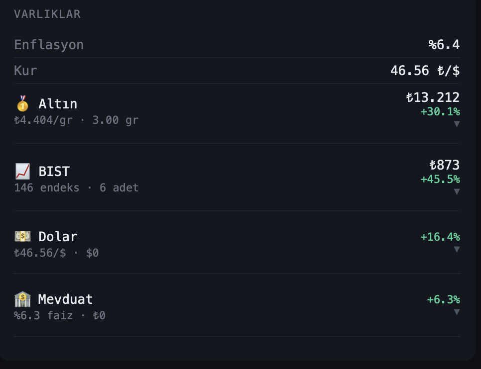

- **Sprint Review**: 
Alınan kararlar:
Sprint 1 sonunda ürünün temel geliştirme planı tamamlanmış, Product Backlog oluşturulmuş ve görev dağılımı netleştirilmiştir.
Sprint kapsamında geliştirilecek modüller belirlenmiş, Miro Board üzerinde sprint yönetimi oluşturulmuş ve geliştirme sürecine başlanmıştır.
Bir sonraki sprintte oyun motorunun (Core Engine), karakter oluşturma sistemi ve temel kullanıcı arayüzünün geliştirilmesine ağırlık verilmesi kararlaştırılmıştır.
Sprint Review Katılımcıları:
- Product Owner
- Scrum Master
- Development Team

- **Sprint Retrospective:**
- Takım içindeki görev dağılımının ve sorumlulukların daha dengeli olacak şekilde yeniden düzenlenmesi.
- Daily Scrum toplantılarının düzenli ve planlı bir şekilde gerçekleştirilmesi.
-  GitHub üzerinde daha sık commit yapılması.
- Sprint Board'un geliştirme süreci boyunca güncel tutulması.
- Story'lerin gerektiğinde daha küçük görevlere (task) bölünerek geliştirme sürecinin kolaylaştırılması.
---

# Sprint 2

- **Backlog düzeni ve Story seçimleri**:
Sprint 2 kapsamında oyunun temel özelliklerinin üzerine daha karmaşık finansal mekanikler ve iyileştirmeler eklenmesi planlanmıştır.

Yapılan geliştirmeler şu şekilde özetlenebilir:
- Sektörel borsa eventleri ve fısıltı haberler (Whisper News) mekaniği eklendi.
- Gayrimenkul sistemi ve araç piyasası entegrasyonu tamamlandı.
- Reel getiri hesaplamaları ve fırsat maliyeti grafiği oyun raporuna dâhil edildi.
- Oyuna yeni iş sistemi, öğretici mod (Tutorial) ve açılış ekranında eğitici açıklamalar eklendi.
- Yaşam standartları maliyetleri ve etkileri dengelendi.
- AI ajanları (AI agents) entegrasyonu tamamlandı.
- Varlıklar sayfasına portföy değeri, nakit ve enflasyon kartları eklendi.
- Geliştirici leaderboard'u (Dev leaderboard) ve UI iyileştirmeleri yapıldı.

- **Daily Scrum**:
Daily Scrum toplantıları Slack üzerinden yapılmaya devam etmiştir. Ekip üyeleri kodlama sürecinde karşılaştıkları problemleri hızlıca birbirlerine danışarak (örneğin; build hataları, CORS izinleri) çözüm üretmişlerdir. 

- **Sprint board update**: Sprint board screenshotları:
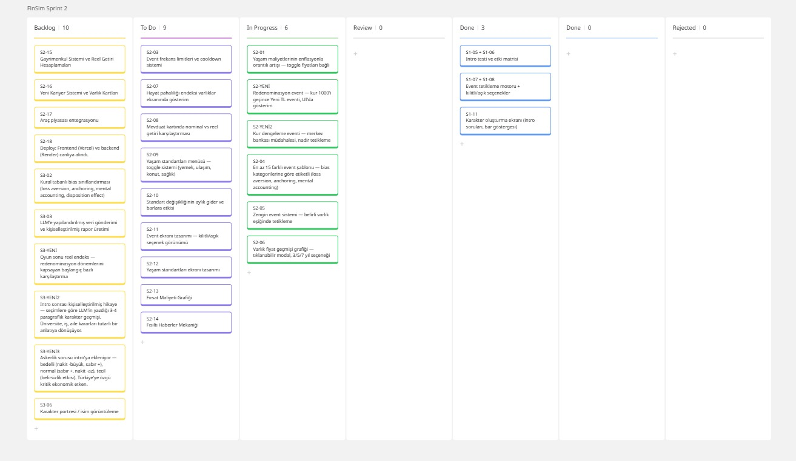
Sprint 2 Sprint Board - 1 (Başlangıç): Sprint 2 başlangıcında Product Backlog'da yer alan Story'ler öncelik sırasına göre Sprint Board'a aktarılmıştır. Sprint 1'den devreden görevler ile Sprint 2 kapsamında planlanan geliştirmeler Backlog, To Do, In Progress, Review, Done ve Rejected sütunlarına yerleştirilerek sprint planlaması oluşturulmuştur.

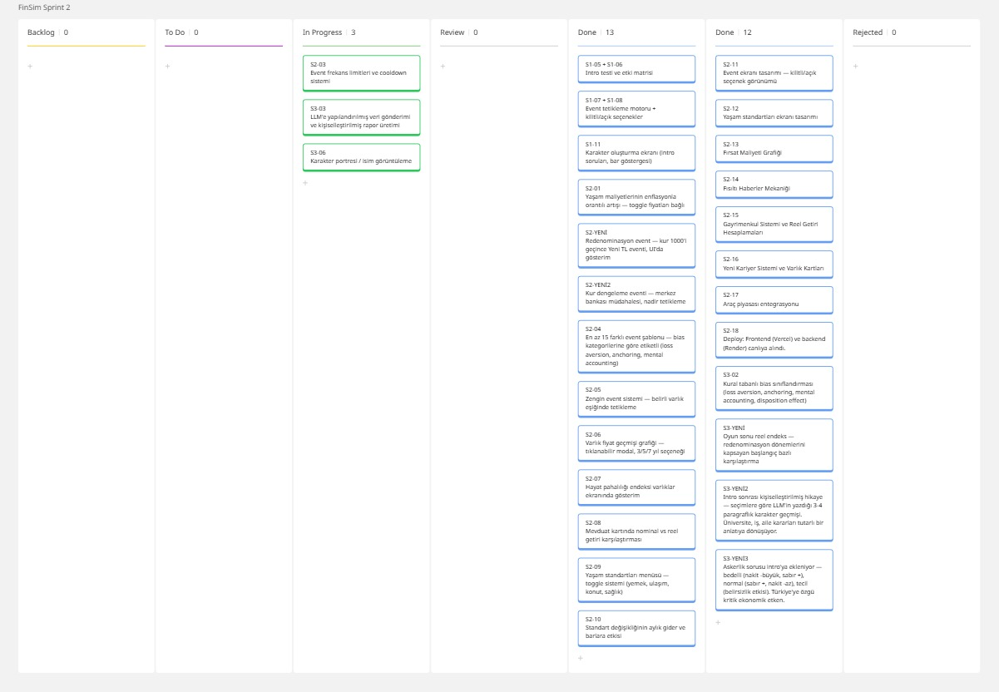
Sprint 2 Sprint Board - 2 (Sprint Sonu): Sprint 2 süresince Story'lerin ilerleme durumu Miro Sprint Board üzerinden takip edilmiş, tamamlanan görevler geliştirme süreçlerinin ardından Done sütununa taşınmıştır.

- **Ürün Durumu**: 
  

  
Görselleri Göster / Gizle

  ### Giriş Ekranı
  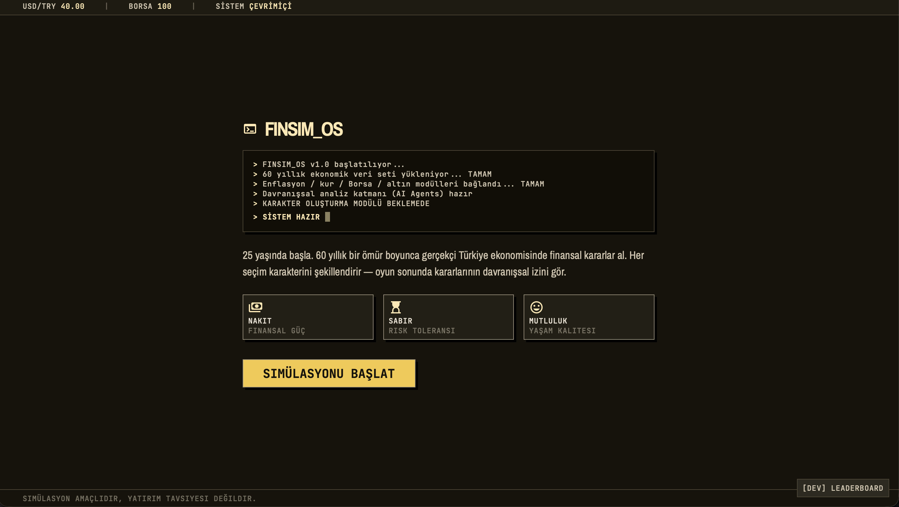

  ### Karakter Intro
  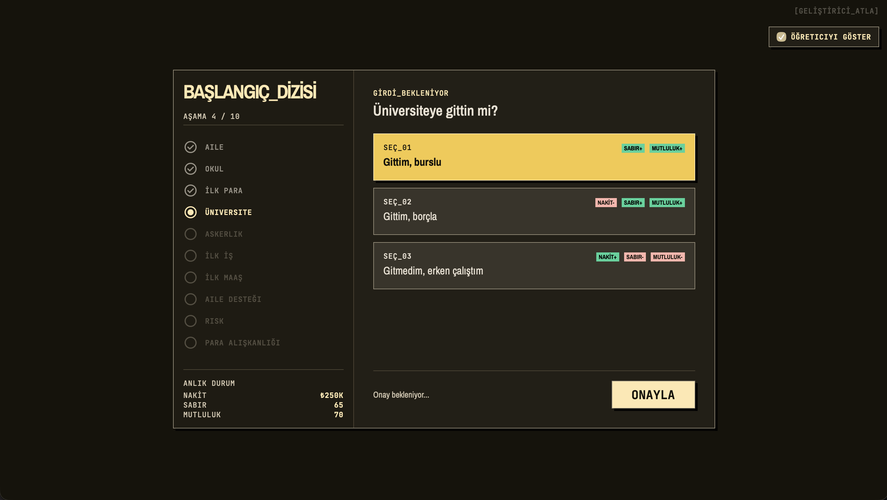

  ### Ana Sayfa
  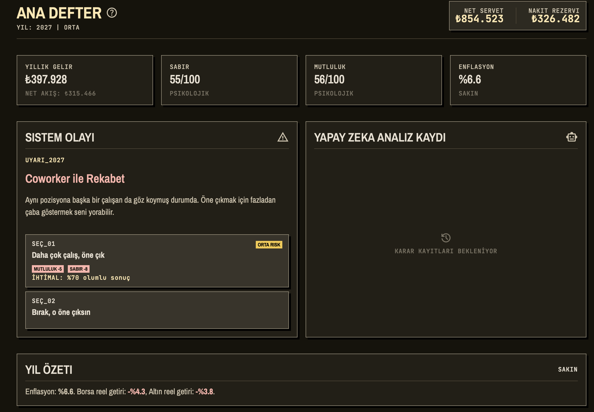

  ### Varlıklar
  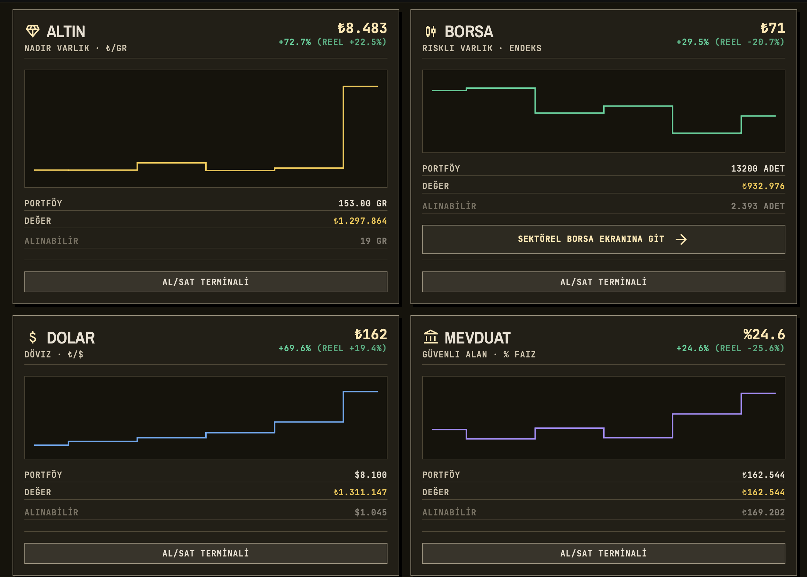

  ### Portföy Dağılımı
  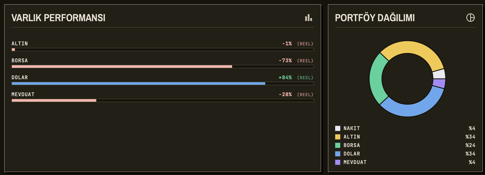

  ### Gayrimenkul Piyasası
  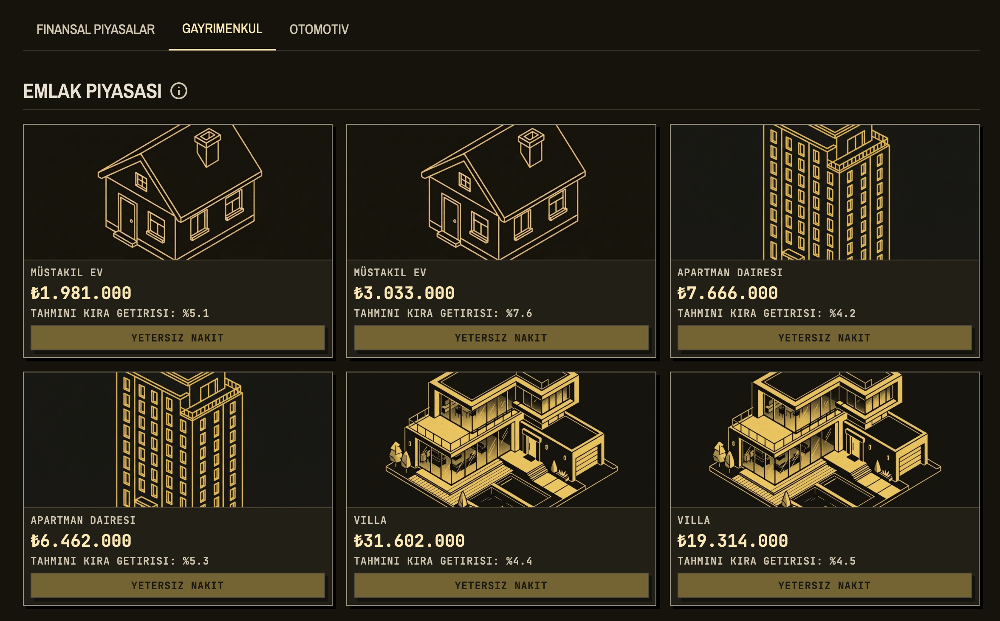

  ### Otomobil Piyasası
  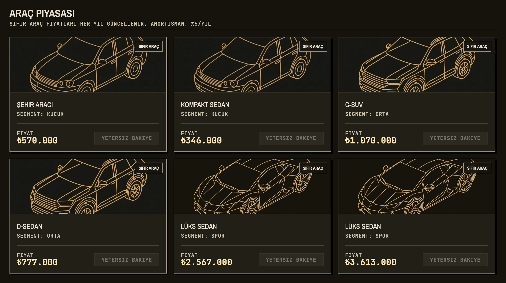

  ### Yaşam İhtiyaçları
  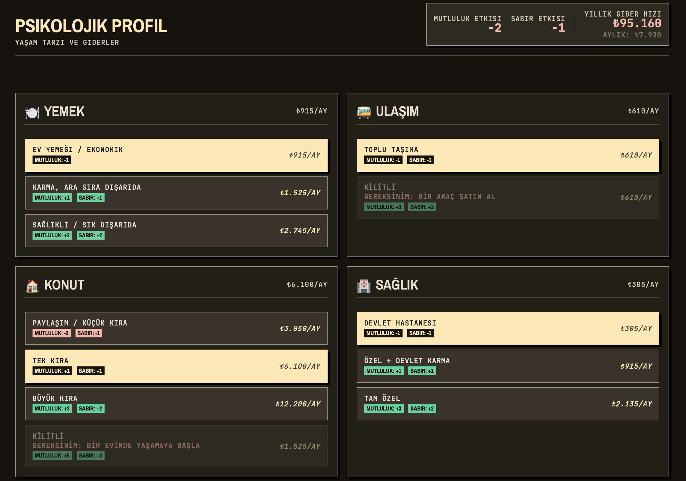

  ### Sonuç Raporu
  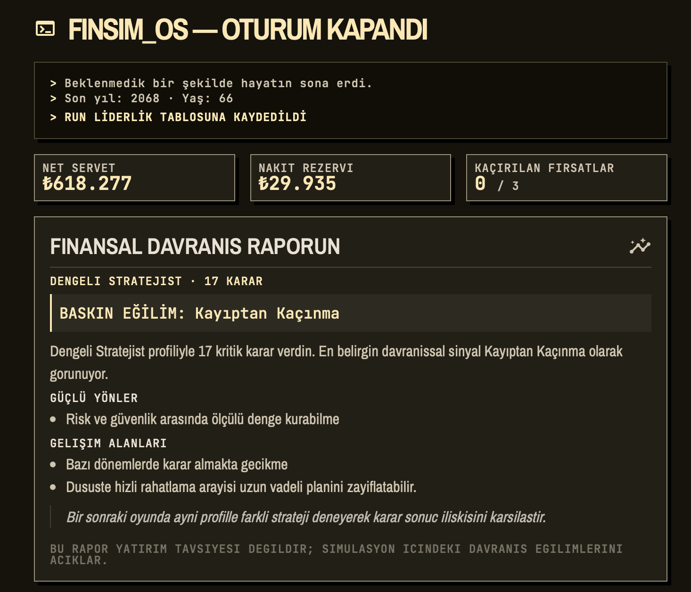

  ### Fırsat Maliyeti
  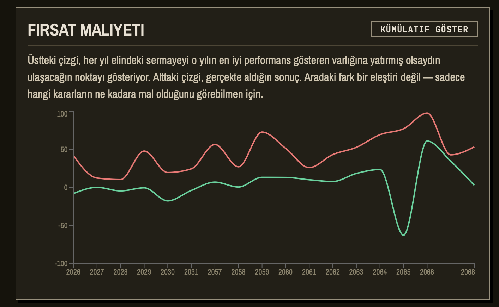

  ### Yapay Zeka Değerlendirmesi
  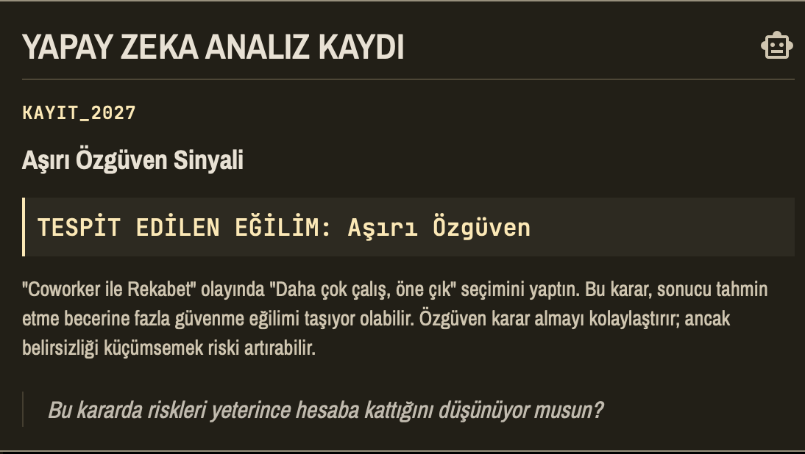

  

- **Sprint Review**: 
Alınan kararlar:
Sprint 2 sonucunda temel ve gelişmiş mekaniklerin (Borsa, gayrimenkul, iş, yaşam standartları, AI) birçoğu oyuna entegre edildi ve UI iyileştirilmeleri ile oyuncuya daha iyi bir deneyim sunulması sağlandı.
Oyun sonu geri bildirimlerin (AI agents, fırsat maliyeti) zenginleştirildiği görüldü.
Bir sonraki sprintte sistemlerin detaylı test edilmesi, varsa açıkların kapatılması ve oyunun final cila aşamalarının yapılması kararlaştırıldı.

Sprint Review Katılımcıları:
- Product Owner
- Scrum Master
- Development Team

- **Sprint Retrospective:**
- Oyun içi ekonominin (yaşam standartları, enflasyon etkileri vb.) dengelenmesine önem verilmesinin faydalı olduğu anlaşıldı.
- Commit mesajlarının ve geliştirmelerin özellik (feature) bazlı yapılması iş takibini kolaylaştırdı, bu yaklaşıma devam edilecek.
- Eksik görülen noktalarda hızlı aksiyon alınıp öğretici (tutorial) eklentileri gibi özelliklerin sunulması ürünün kullanılabilirliğini artırdı.

  

---

# Sprint 3

- **Backlog düzeni ve Story seçimleri**:
Sprint 3 kapsamında ürünün final sürümünü tamamlamaya yönelik geliştirmelere odaklanılmıştır. Önceki sprintlerde geliştirilen temel oyun mekanikleri; davranışsal finans, yapay zekâ destekli analizler ve oyuncu deneyimini zenginleştiren yeni sistemlerle geliştirilmiştir. Ayrıca oynanabilirliği ve sistem kararlılığını artırmak amacıyla performans iyileştirmeleri ve hata düzeltmeleri gerçekleştirilmiştir.

Yapılan geliştirmeler şu şekilde özetlenebilir:

- Davranışsal finans altyapısı geliştirilerek Loss Aversion, Anchoring, Disposition Effect, Mental Accounting ve Present Bias eğilimleri başlangıç profili ve oyun mekanikleriyle ilişkilendirildi.
- Oyun başlangıcına davranışsal finans eğilimlerini tanıtan bilgilendirme ekranı ve bias ikonları eklendi.
- Oyuncunun sabır ve mutluluk değerleri oyun boyunca takip edilerek oyun sonunda çizgi grafik ile görselleştirildi.
- Yapay zekâ destekli davranış raporu; ortalama mutluluk, kriz yılı sayısı ve sabır değişimi gibi yeni metriklerle zenginleştirildi.
- Sprint 2’de kural tabanlı olarak geliştirilen AI agentları Gemini ile entegre edildi.
- LangChain kullanılarak Decision Analyst, Bias Coach, Final Report, Learning Plan ve Safety Agent arasında veri aktarımına dayalı iş akışları oluşturuldu.
- Akademik kaynaklardan hazırlanan yerel RAG sisteminde MiniLM embedding ve benzerlik araması kullanılarak AI yorumlarının kaynak destekli ve bağlamsal geri bildirimler üretmesi sağlandı.
- Agent Memory yapısı sayesinde Bias Coach’un oyuncunun önceki kararlarını ve tekrar eden davranışlarını takip etmesi sağlandı.
- AI tarafından oluşturulan metinlerin yatırım tavsiyesi, garanti getiri veya klinik teşhis içermemesi için Safety Agent kontrolü eklendi.
- Gemini veya embedding modelinin kullanılamadığı durumlarda oyunun kesintiye uğramaması için kural tabanlı fallback sistemi geliştirildi.
- Üniversite eğitimi, iş başvuruları, kariyer ilerlemesi ve terfi mekaniklerinden oluşan kariyer sistemi oyuna eklendi.
- Dinamik kredi sistemi, portföy bazlı kredi limiti, faiz hesaplamaları ve iflas/haciz mekanikleri geliştirildi.
- Swing Trade ve Opsiyon Piyasası ekranları eklenerek yüksek risk içeren finansal kararların deneyimlenebileceği yeni oyun mekanikleri oluşturuldu.
- Sosyal yaşam sistemi geliştirilerek evlilik, çocuk, miras, boşanma, nafaka ve yaşam standartlarına bağlı harcama mekanikleri oyuna eklendi.
- Testlerde tespit edilen hatalar giderildi, kullanıcı arayüzü iyileştirildi ve performans optimizasyonları gerçekleştirildi.

- **Daily Scrum**:
Sprint 3 süresince Daily Scrum toplantıları Slack üzerinden düzenli olarak gerçekleştirilmeye devam etmiştir. Günlük toplantılarda entegrasyon süreçleri, testlerde tespit edilen hatalar ve performans iyileştirmeleri değerlendirilmiş, görev dağılımları güncellenerek geliştirme sürecinin planlanan takvim doğrultusunda ilerlemesi sağlanmıştır.

- **Sprint board update**: Sprint board screenshotları:

- **Ürün Durumu**: 

- **Sprint Review**:
Alınan kararlar:
Sprint 3 sonunda ürünün planlanan tüm temel özellikleri başarıyla tamamlanmış ve final sürümüne ulaşılmıştır. Davranışsal finans altyapısı oyun mekaniklerine entegre edilmiş, oyuncuların yatırım eğilimlerini analiz eden başlangıç profili ve bilgilendirme ekranları sisteme eklenmiştir.

Sprint 2'de oluşturulan kural tabanlı AI ajanları Gemini ile entegre edilmiş, LangChain altyapısı kullanılarak Decision Analyst, Bias Coach, Final Report, Learning Plan ve Safety Agent arasında veri akışı sağlanmıştır. Yerel RAG sistemi sayesinde yapay zekâ analizleri akademik kaynaklarla desteklenmiş, Agent Memory ile oyuncuların geçmiş kararlarının değerlendirilmesi mümkün hale getirilmiştir. Ayrıca Safety Agent ve fallback mekanizması sayesinde yapay zekâ sisteminin güvenli ve kesintisiz çalışması sağlanmıştır.

Bunun yanında kariyer sistemi, kredi ve haciz mekanikleri, Swing Trade, Opsiyon Piyasası ve sosyal yaşam sistemi oyuna başarıyla entegre edilmiştir. Sprint sonunda gerçekleştirilen testlerle tespit edilen hatalar giderilmiş, kullanıcı arayüzü geliştirilmiş ve performans optimizasyonları tamamlanarak ürün sunuma hazır final sürümüne ulaştırılmıştır.

Sprint Review Katılımcıları:
- Product Owner
- Scrum Master
- Development Team

- **Sprint Retrospective:**
- Davranışsal finans mekaniklerinin oyuna entegre edilmesi ürünün eğitim ve farkındalık yönünü önemli ölçüde güçlendirdi.
- Gemini, LangChain ve yerel RAG altyapısının kullanılmasıyla yapay zekâ tarafından oluşturulan analizlerin doğruluğu ve kişiselleştirme seviyesi artırıldı.
- Agent Memory ve Safety Agent mekanizmalarının eklenmesi, AI çıktılarının daha güvenilir ve tutarlı hale gelmesini sağladı.
- Kural tabanlı fallback sistemi sayesinde dış servislerde yaşanabilecek sorunların oyun deneyimini etkilememesi sağlandı.
- Yeni eklenen kariyer, kredi, yatırım ve sosyal yaşam sistemlerinin mevcut oyun yapısına modüler şekilde entegre edilmesi geliştirme sürecini kolaylaştırdı.
- Final sprint boyunca gerçekleştirilen kapsamlı testler sayesinde kullanıcı deneyimini olumsuz etkileyen hatalar giderildi ve performans iyileştirmeleri başarıyla tamamlandı.
- Takım içi iletişim ve düzenli görev takibi sayesinde sprint hedefleri planlanan süre içerisinde tamamlandı.
- Final sürüm ile birlikte ürünün hem teknik altyapısı hem de eğitim odaklı yapısı hedeflenen seviyeye ulaştırılmış oldu.

  
---
