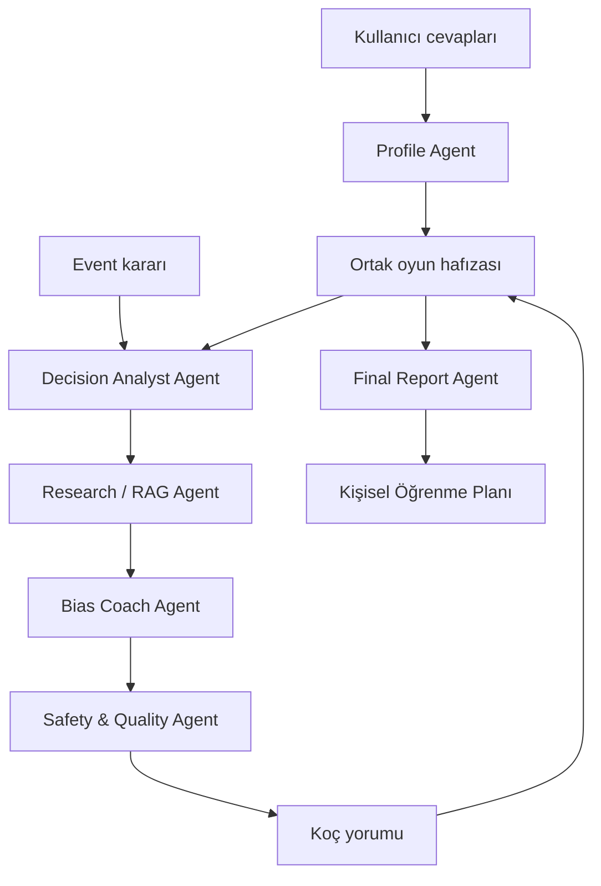

# AI Agent Mimarisi

Bu belge FINSIM'in Sprint 2'de çalışan agent yapısını anlatır. Henüz geliştirilmemiş Sprint 3 işleri ayrıca belirtilmiştir.

## Amaç

Agent katmanı, oyuncunun simülasyon içindeki kararlarını davranışsal finans açısından açıklamak için kullanılır. Para, getiri, enflasyon ve portföy hesapları oyun motorunda kalır. Agent'lar oyun durumunu değiştirmez ve yatırım tavsiyesi vermez.

## Sprint 2 Akışı

```text
Intro cevapları
      |
      v
Profile Agent
      |
      +----> Oyuncu profili
      |
      v
İlk 25 yıl hikâyesi
      |
Event seçimi ---> Bias Coach Agent ---> Koç yorumu
      |
      v
eventKayitlari
      |
      v
Final Report Agent ---> Davranış raporu
```

`eventKayitlari`, oyun oturumu boyunca verilen kararları tutar. Bu kayıtlar koç yorumundan bağımsız olarak saklanır ve final rapor hazırlanırken toplu biçimde gönderilir. Sprint 2 için agent hafızası bu oturum verisidir; kalıcı kullanıcı hafızası henüz yoktur.

## Agent'lar

### Profile Agent

İlk 10 soruda seçilen cevap metinlerinden bir risk puanı çıkarır; bu puanı başlangıç nakdi, sabır ve mutluluk değerleriyle birlikte değerlendirir. Sonuç olarak profil adı, risk seviyesi, güçlü yön ve gelişim alanı döndürür. Ayrıca cevaplarda gerçekten bulunan seçimlerden `intro_story` alanını üretir. Cevaplar tırnak içinde sıralanmaz; çocukluk, ilk para, eğitim, iş hayatı ve 25 yaşa geliş anları üç paragraflık yaşam sahnelerine dönüştürülür. Bu hikâye intro ile ana oyun arasında gösterilerek karakter oluşturma bölümünün anket yerine oyunun geçmişi gibi algılanmasını sağlar.

Sınıflandırma ve mevcut hikâye üretimi kural tabanlıdır; aynı veri her zaman aynı sonucu üretir. Profil sınıflandırması tek sıra hâlindeki `if/else` eşikleri yerine `weighted_prototypes_v1` modelini kullanır. Risk ortalaması, sabır, mutluluk ve başlangıç nakdi normalize edilir; her oyuncu altı davranış prototipine olan ağırlıklı uzaklığına göre sınıflandırılır. Risk en güçlü sinyaldir, ancak diğer üç özellik yakın profilleri birbirinden ayırır.

Tüm soru kilitleri hesaba katılarak 46.116 geçerli cevap yolu taranmıştır. Altı profil de ulaşılabilirdir; merkez profil olan Dengeli Stratejist yolların yaklaşık %30'unda görülür ve hiçbir profil yalnızca istisnai birkaç cevaba bağlı kalmaz. Her profil için ayrı regresyon testi vardır.

`story_source` alanı şu anda `rule_based_fallback` değerindedir. LLM ile daha akıcı hikâye üretimi Sprint 3'e bırakılmıştır; servis kullanılamadığında bu çalışan fallback korunacaktır.

### Bias Coach Agent

Bir event seçildikten sonra event'in `bias_etiketi` alanını kullanır. Eğilimin Türkçe adını, seçilen event ve seçeneğe bağlanan kısa açıklamayı ve oyuncunun kararını yeniden düşünmesini sağlayacak bir soru döndürür.

Her karar `eventKayitlari` içinde saklanır; fakat koç paneli her kararda açılmaz. `should_show` ve `trigger_reason` alanları aşağıdaki kurallara göre üretilir:

- İlk karar
- Yeni bir davranış eğiliminin ilk görülmesi
- Aynı eğilimin her üçüncü tekrarı
- Finansal etkisi yüksek karar
- Her beş kararlık ara değerlendirme

Event verisinde kullanılan `asiri_ozguven` ve `status_quo` etiketleri agent içinde sırasıyla `overconfidence` ve `status_quo_bias` kanonik adlarına çevrilir. Final rapor da aynı normalizasyonu kullanır.

Sprint 2'de koç yorumunun temelini event etiketi ve karar geçmişindeki tekrar sayısı belirler. Seçenek bazında ayrı LLM sınıflandırması Sprint 3 için değerlendirilecektir.

### Final Report Agent

Oyun boyunca biriken event kayıtlarını sayar, en sık görülen davranış eğilimini belirler ve profil bilgisiyle birlikte özetler. Boş event geçmişinde de geçerli bir rapor döndürür.

## API Uçları

| İşlem | Ana endpoint | Türkçe alias |
| --- | --- | --- |
| Profil oluşturma | `POST /agents/profile` | `POST /ajanlar/profil` |
| Koç yorumu | `POST /agents/coach` | `POST /ajanlar/koc` |
| Final rapor | `POST /agents/final-report` | `POST /ajanlar/final-rapor` |

Frontend Türkçe endpoint'leri kullanır. İngilizce endpoint'ler dış kullanım ve teknik tutarlılık için aynı davranışla korunur.

## Sınırlar

- Sayısal oyun hesapları agent katmanında yapılmaz.
- Agent çıktıları eğitim ve farkındalık amaçlıdır.
- Her agent çıktısında yatırım tavsiyesi verilmediğini belirten açıklama bulunur.
- Agent isteği başarısız olursa simülasyon durmaz; oyun kendi akışına devam eder.
- API adresi `VITE_API_BASE_URL` ile değiştirilebilir. Varsayılan yerel adres `http://127.0.0.1:8000` değeridir.

## Sprint 3 Hedef Orkestrasyonu

Aşağıdaki yapı Sprint 3 için planlanan agent akışıdır. Bu bölüm hedef mimariyi gösterir; yeni agent'lar henüz Sprint 2 kodunun parçası değildir.



### Decision Analyst Agent

Oyuncunun profilini, güncel finansal durumunu, event'i, seçilen seçeneği ve önceki kararlarını birlikte değerlendirir. Kararda görülen davranış eğilimini ve bu sonuca hangi verilerle ulaşıldığını yapılandırılmış bir çıktı olarak verir. Oyun hesaplarını veya portföyü değiştirmez.

### Research / RAG Agent

Decision Analyst tarafından belirlenen konuya göre bilgi tabanından ilgili parçaları getirir. Bilgi tabanı yalnızca bias makaleleriyle sınırlı değildir; şu içerikleri de kapsayabilir:

- Davranışsal finans eğilimleri ve akademik kaynak özetleri
- Risk, getiri, enflasyon, çeşitlendirme ve fırsat maliyeti gibi finansal okuryazarlık konuları
- Oyuncu profillerinin açıklamaları
- Event'lerde geçen finansal kavramlar
- Koç dili ve yatırım tavsiyesi vermeme kuralları
- Final rapor ve öğrenme planında kullanılacak eğitim içerikleri

Agent, bulduğu parçalarla birlikte kaynak adı, yazar, yıl ve bağlantı bilgisini döndürür. Ham PDF'ler public repoya eklenmez; doğrulanmış Türkçe özetler ve kaynak bilgileri indekslenir.

### Bias Coach Agent

Decision Analyst çıktısını, oyuncu profilini ve RAG bağlamını kullanarak kişiselleştirilmiş bir koç yorumu hazırlar. Yorum; davranış eğilimini açıklar, oyun kararına bağlar ve oyuncuya kısa bir düşünme sorusu yöneltir.

### Safety & Quality Agent

Koç yorumunu kullanıcıya gösterilmeden önce kontrol eder. Metnin yatırım tavsiyesi içermemesi, oyun verileriyle çelişmemesi, getirilen kaynaklara dayanması ve uygun bir dil kullanması beklenir. Kontrol başarısız olursa yorum yeniden üretilir veya Sprint 2'deki kural tabanlı metne dönülür.

### Final Report Agent

Ortak hafızadaki profil, event geçmişi, koç yorumları ve finansal durumu bir araya getirir. Baskın eğilimleri, güçlü yönleri, gelişim alanlarını ve kararların oyun boyunca nasıl değiştiğini kaynaklı biçimde özetler.

### Learning Plan Agent

Final rapordaki gelişim alanlarına göre kısa bir öğrenme planı oluşturur. Kullanıcıya alım-satım önerisi vermek yerine üzerinde çalışabileceği kavramları, ilgili içerikleri ve yeni oyun senaryolarını sıralar.

### Orkestrasyon ve Hafıza

LangGraph, agent'ların çalışma sırasını ve ortak durumu yönetmek için planlanmaktadır. Ortak `GameState` en az şu alanları taşır:

```text
profile
current_financial_state
current_event
selected_option
event_history
detected_bias
retrieved_sources
coach_comment
safety_result
final_report
learning_plan
```

Intro tamamlandığında profil akışı, event seçildiğinde analiz-koçluk akışı, oyun sonunda ise final rapor-öğrenme planı akışı çalışır. Sprint 2'deki kural tabanlı agent'lar, LLM veya RAG servisi kullanılamadığında yedek davranış olarak korunur.

## Kontroller

Agent testleri repo kökünden şu komutla çalıştırılır:

```powershell
python -m unittest discover -s backend/tests -v
```

Frontend kontrolleri:

```powershell
cd frontend
npm run lint
npm run build
```
